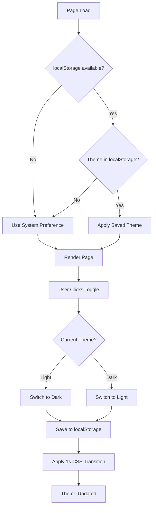
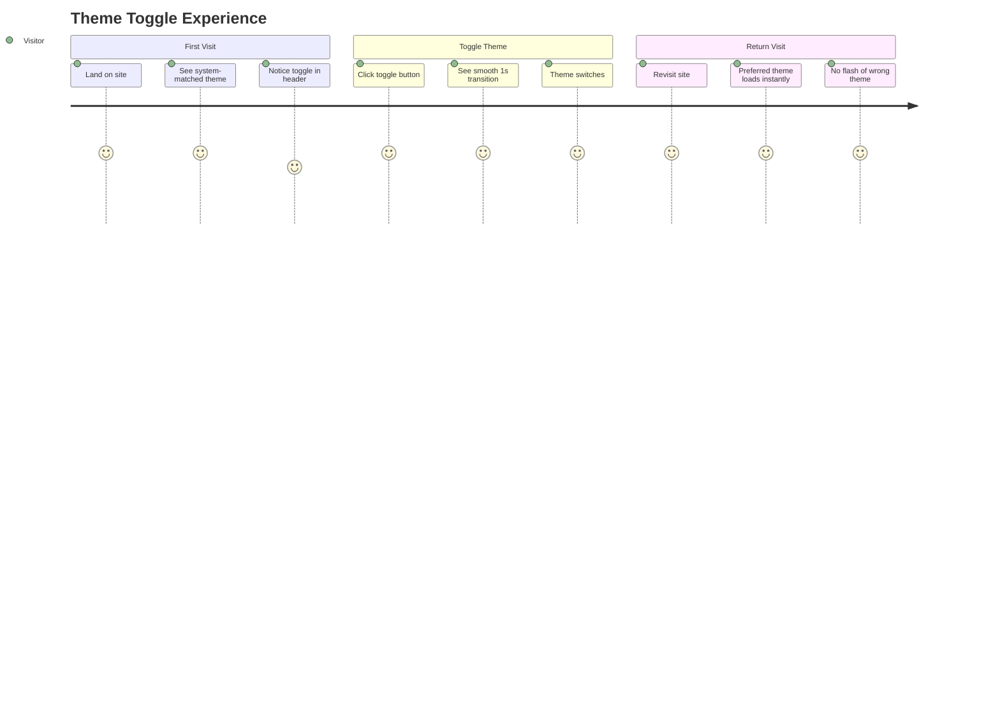

´´
**Status:** DONE
**Date:** 2025-11-29

## Prerequisites
| ID | Title | Status |
| :--- | :--- | :--- |
| 001 | Project Foundation & Dependencies Setup | Done |

## Title
Theme System (Dark/Light Mode)

## Description
**User Story:**
As a visitor, I want to toggle between dark and light mode, so that I can view the portfolio in my preferred color scheme.

**Context:**
Implement theme switching using next-themes with localStorage persistence. Priority: localStorage > system preference. Must prevent flash of wrong theme on initial load using blocking script approach.

## Acceptance Criteria (Gherkin)
```gherkin
Scenario: Theme toggle switches between modes
  Given I am on any page
  When I click the theme toggle button
  Then the theme switches from dark to light (or vice versa)
  And background and accent colors transition over 1 second

Scenario: Theme persists across sessions
  Given I have selected dark mode
  When I close and reopen the browser
  Then dark mode is still active

Scenario: No flash of wrong theme on load
  Given I have dark mode saved in localStorage
  When I hard refresh the page with cleared cache
  Then I do not see a flash of light mode before dark mode loads

Scenario: System preference is secondary
  Given my OS is set to dark mode
  And localStorage has light mode saved
  When I visit the site
  Then light mode is displayed (localStorage takes priority)
```

## Technical Decisions (from Q&A)

### Dependencies
- Add `next-themes` package for theme management
- Use default localStorage key (`"theme"`)

### Implementation
- Add `suppressHydrationWarning` to `<html>` element in `app/layout.tsx`
- Default theme: `"system"` (follows OS preference until user explicitly chooses)
- Use built-in `next-themes` blocking script approach for FOUC prevention
- Apply `.dark` class to `<html>` element (`attribute="class"`)

### UI Components
- Create standalone `ThemeToggle` component (`components/theme-toggle.tsx`)
- Create `Header` component (`components/header.tsx`) containing the theme toggle
- Use `lucide-react` icons: `Sun` and `Moon`
- Binary toggle: switches between `light` ↔ `dark` only (no system option in toggle)

### Styling
- CSS transitions on `background-color` and accent colors only
- Transition duration: 1 second
- Easing function: `ease-in-out`

### Testing
- Add automated Vitest tests for theme toggle functionality

# UI Specification: Theme System (Dark/Light Mode)

**Story ID:** 002  
**Date:** 2025-11-29  
**Design Approach:** Mobile First  
**Component Library:** Shadcn/ui + Tailwind CSS

---

## 1. Page Layout & Structure

### Layout
- **Header:** Fixed/sticky top navigation bar containing the theme toggle
- **Toggle Position:** Right side of header (mobile: far right with adequate touch target)

### Key Components
| Component | Source | Purpose |
|:----------|:-------|:--------|
| `ThemeProvider` | `next-themes` | Wraps app, manages theme state |
| `Button` | `shadcn/ui` | Base for toggle (variant: `ghost`, size: `icon`) |
| `Sun` | `lucide-react` | Light mode indicator icon |
| `Moon` | `lucide-react` | Dark mode indicator icon |
| `Header` | Custom | Container component for navigation + toggle |

### Component Hierarchy
```
app/layout.tsx
└── ThemeProvider (next-themes)
    └── Header
        └── ThemeToggle
            └── Button (shadcn)
                └── Sun / Moon / Placeholder Icon
```

---

## 2. Interaction Flow (Mermaid)



### User Journey


---

## 3. UI States (The 4 Critical States)

| State | Visual Description | Copy/Text | Technical Notes |
|:------|:-------------------|:----------|:----------------|
| **SSR/Hydrating** | Placeholder icon (e.g., `Circle` or `Monitor`) with reduced opacity (50%) | `aria-label="Loading theme"` | Icon visible but indicates loading state; prevents layout shift |
| **Light Mode Active** | `Sun` icon displayed, button has subtle hover state | `aria-label="Switch to dark mode"` | Icon: `Sun` from lucide-react |
| **Dark Mode Active** | `Moon` icon displayed, button has subtle hover state | `aria-label="Switch to light mode"` | Icon: `Moon` from lucide-react |
| **Transitioning** | Background and accent colors animate over 1s | N/A | CSS transition: `background-color 1s ease-in-out` |
| **localStorage Unavailable** | Functions normally, falls back to system preference | No user-facing message | Silent fallback; `next-themes` handles gracefully |

### Icon State Matrix
| Hydration State | Resolved Theme | Icon Shown |
|:----------------|:---------------|:-----------|
| Mounting (SSR) | Unknown | `Monitor` (placeholder) @ 50% opacity |
| Mounted | Light | `Sun` |
| Mounted | Dark | `Moon` |

---

## 4. Component Specifications

### ThemeToggle Component
```
Location: components/theme-toggle.tsx
Type: Client Component ("use client")
```

| Property | Value |
|:---------|:------|
| Button Variant | `ghost` |
| Button Size | `icon` |
| Icon Size | `h-5 w-5` (20px) |
| Touch Target | Minimum 44x44px (mobile a11y) |
| Hover State | `hover:bg-accent` (Shadcn default) |
| Focus State | `focus-visible:ring-2 ring-ring` |

### Toggle Behavior
| Action | Result |
|:-------|:-------|
| Click when Light | Switch to Dark |
| Click when Dark | Switch to Light |
| Keyboard: Enter/Space | Toggle theme |

---

## 5. Styling & Transitions

### CSS Transition Rules
Apply to `:root` / `html` element:
```css
html {
  transition-property: background-color;
  transition-duration: 1000ms;
  transition-timing-function: ease-in-out;
}

/* Accent color transitions on specific elements */
.transition-colors {
  transition-property: color, background-color, border-color;
  transition-duration: 1000ms;
  transition-timing-function: ease-in-out;
}
```

### Color Tokens (Tailwind/Shadcn)
| Token | Light Mode | Dark Mode |
|:------|:-----------|:----------|
| `--background` | `hsl(0 0% 100%)` | `hsl(0 0% 3.9%)` |
| `--foreground` | `hsl(0 0% 3.9%)` | `hsl(0 0% 98%)` |
| `--accent` | Per design system | Per design system |

---

## 6. Accessibility (a11y) Requirements

### WCAG Compliance
| Requirement | Implementation |
|:------------|:---------------|
| **Keyboard Navigation** | Button is focusable, activates on Enter/Space |
| **Focus Indicator** | Visible focus ring (`ring-2 ring-ring ring-offset-2`) |
| **Touch Target** | Minimum 44x44px clickable area |
| **Screen Reader** | Dynamic `aria-label` based on current theme |
| **Reduced Motion** | Respect `prefers-reduced-motion` - disable transitions |

### ARIA Implementation
```
When Light Mode:
  aria-label="Switch to dark mode"
  
When Dark Mode:
  aria-label="Switch to light mode"
  
During Hydration:
  aria-label="Loading theme"
  aria-busy="true"
```

### Reduced Motion Support
```css
@media (prefers-reduced-motion: reduce) {
  html {
    transition-duration: 0ms !important;
  }
}
```

---

## 7. Responsive Behavior

| Breakpoint | Toggle Position | Size |
|:-----------|:----------------|:-----|
| Mobile (`< 640px`) | Header right, full touch target | 44x44px |
| Tablet (`640px+`) | Header right | 40x40px |
| Desktop (`1024px+`) | Header right | 36x36px |

---

## 8. Edge Cases & Error Handling

| Scenario | Behavior |
|:---------|:---------|
| localStorage blocked (private browsing) | Silent fallback to system preference |
| JavaScript disabled | Theme defaults to light (CSS default), toggle hidden |
| System preference changes while on page | If user hasn't explicitly set theme, follow system |
| Multiple tabs open | Theme syncs across tabs via `storageEventListener` (built into next-themes) |

---

## 9. Mockup Description (Text-to-Image Prompt)

> **Copy this into Midjourney/DALL-E to generate a visual reference:**
>
> "Minimal modern portfolio website header, dark mode and light mode split view comparison, left side showing light theme with sun icon button, right side showing dark theme with moon icon button, clean sans-serif typography, subtle glassmorphism header bar, mobile-first responsive design, Tailwind CSS aesthetic, neutral color palette with slight warm undertones, professional developer portfolio style, high contrast accessibility compliant, 16:9 aspect ratio, UI/UX mockup style, Figma-like presentation"

---

## 10. Implementation Checklist

- [ ] Install `next-themes` package
- [ ] Create `ThemeProvider` wrapper component
- [ ] Add `ThemeProvider` to `app/layout.tsx`
- [ ] Add `suppressHydrationWarning` to `<html>` element
- [ ] Create `ThemeToggle` component with Shadcn Button
- [ ] Create `Header` component containing toggle
- [ ] Add CSS transitions to `globals.css`
- [ ] Add reduced motion media query
- [ ] Write Vitest tests for toggle functionality
- [ ] Test FOUC prevention with hard refresh
- [ ] Verify localStorage persistence
- [ ] Test system preference fallback

---

## 11. Dependencies Summary

| Package | Version | Purpose |
|:--------|:--------|:--------|
| `next-themes` | `^0.4.x` | Theme state management |
| `lucide-react` | (existing) | Sun/Moon/Monitor icons |
| `@shadcn/ui` Button | (existing) | Toggle button component |

---

##  QA Testing Strategy
> **Context:** Derived from One-Pager constraints and Story acceptance criteria.

### 1. Manual Verification (The Happy Path)
- [X] **TC-001:** Navigate to any page → Click the theme toggle button  Verify theme switches from dark to light (or vice versa)  Confirm background and accent colors transition smoothly over 1 second
- [X] **TC-002:** Select dark mode  Close browser completely  Reopen browser and navigate to site  Verify dark mode is still active (check localStorage key `theme`)
- [X] **TC-003:** Set localStorage to dark mode  Hard refresh (Ctrl+Shift+R) with cache cleared  Verify NO flash of light mode before dark mode renders
- [X] **TC-004:** Set OS to dark mode  Set localStorage to light mode  Visit site  Verify light mode is displayed (localStorage takes priority over system preference)
- [X] **TC-005:** Verify `Sun` icon displays when light mode is active  Verify `Moon` icon displays when dark mode is active
- [X] **TC-006:** During SSR/hydration  Verify placeholder icon (`Monitor`) displays at 50% opacity with `aria-label="Loading theme"`

### 2. Edge Cases & Destructive Testing
- [X] **TC-007:** Open browser in private/incognito mode (localStorage may be blocked)  Verify fallback to system preference works gracefully, no console errors
- [X] **TC-008:** Clear localStorage completely  Verify site defaults to system preference (`system` default)
- [X] **TC-009:** Open multiple browser tabs  Toggle theme in one tab  Verify all tabs sync to new theme via `storageEventListener`
- [X] **TC-010:** Spam-click the theme toggle rapidly (10+ times)  Verify no JS errors, animations queue correctly, no UI freeze
- [X] **TC-011:** Disable JavaScript in browser  Verify page still renders (defaults to light theme), toggle button is hidden
- [ ] **TC-012:** Enable `prefers-reduced-motion: reduce` in OS settings  Verify CSS transitions are disabled (duration 0ms)
- [ ] **TC-013:** During theme transition (mid-1s animation)  Click toggle again  Verify behavior is stable (no glitches)

### 3. One-Pager Constraints Check
- [ ] **Scope (Mobile):** Test on mobile viewport (320px min width)  Verify toggle has 44x44px touch target
- [ ] **Scope (Touch):** Test on touch device  Verify toggle responds to tap events correctly
- [ ] **Performance:** Run Lighthouse audit  Verify Performance score > 80 (no blocking from theme logic)
- [ ] **FOUC Prevention:** Test with `next-themes` blocking script  Confirm `suppressHydrationWarning` on `<html>` element
- [ ] **3D Integration:** Toggle theme  Verify 3D particle colors in hero section transition over 1 second (per One-Pager spec)

### 4. Accessibility (a11y) Verification
- [ ] **TC-014:** Tab to theme toggle  Verify visible focus ring (`ring-2 ring-ring ring-offset-2`)
- [ ] **TC-015:** Press Enter or Space on focused toggle  Verify theme switches
- [ ] **TC-016:** Use screen reader (NVDA/VoiceOver)  Verify `aria-label` announces "Switch to dark mode" (when light) or "Switch to light mode" (when dark)
- [ ] **TC-017:** During hydration  Verify `aria-busy="true"` is present on toggle

### 5. Cross-Browser Testing Matrix
| Browser | Theme Toggle | Transition | Persistence | FOUC Check |
|:--------|:-------------|:-----------|:------------|:-----------|
| Chrome Desktop | [ ] | [ ] | [ ] | [ ] |
| Firefox Desktop | [ ] | [ ] | [ ] | [ ] |
| Safari Desktop | [ ] | [ ] | [ ] | [ ] |
| Chrome Mobile | [ ] | [ ] | [ ] | [ ] |
| Safari Mobile | [ ] | [ ] | [ ] | [ ] |

