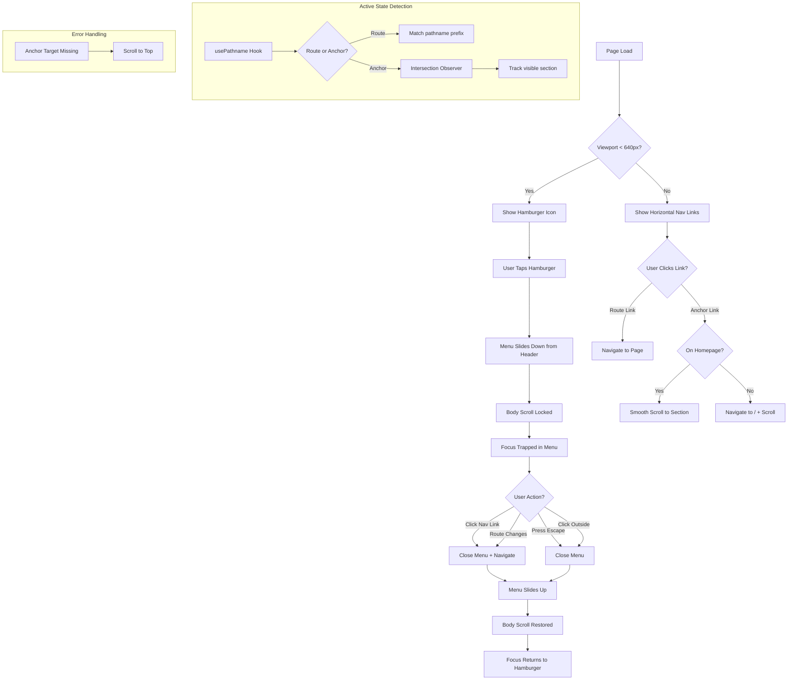

**Status:** ✅ READY FOR QA
**Date:** 2025-11-29
**Updated:** 2025-11-30

## Prerequisites
| ID | Title | Status |
| :--- | :--- | :--- |
| 001 | Project Foundation & Dependencies Setup | Done |
| 002 | Theme System (Dark/Light Mode) | Done |
| 005 | Smooth Scroll & Animations | Done |

## Title
Navigation & Layout Shell

## Description
**User Story:**
As a visitor, I want a consistent navigation header across all pages, so that I can easily navigate between sections and pages.

**Context:**
Create the root layout with header navigation. Header should include: logo/name, nav links (Home, Projects, Blog, Contact), and theme toggle. Navigation should work for both anchor links on homepage and route links to separate pages. Responsive hamburger menu on mobile.

## Acceptance Criteria (Gherkin)
```gherkin
Scenario: Navigation is visible on all pages
  Given I am on any page of the portfolio
  When the page loads
  Then I see a header with navigation links

Scenario: Navigation links work correctly
  Given I am on the homepage
  When I click on "Blog" in the nav
  Then I am navigated to /blog

Scenario: Theme toggle in header
  Given I am viewing the header
  When I click the theme toggle icon
  Then the theme switches between dark and light

Scenario: Mobile hamburger menu
  Given I am on a mobile device (viewport < 640px)
  When I view the header
  Then I see a hamburger menu icon
  And clicking it reveals the navigation links in a full-screen overlay

Scenario: Mobile menu closes appropriately
  Given the mobile menu is open
  When I click a navigation link
  Then the menu closes and I navigate to the destination
  And the menu also closes when I click outside or press Escape

Scenario: Active state on current page
  Given I am on /blog
  When I view the navigation
  Then the Blog link is visually highlighted as active

Scenario: Active state on nested routes
  Given I am on /blog/some-post
  When I view the navigation
  Then the Blog link is visually highlighted as active

Scenario: Active state on anchor sections
  Given I am on the homepage scrolled to #projects
  When I view the navigation
  Then the Projects link is visually highlighted as active

Scenario: Cross-page anchor navigation
  Given I am on /blog
  When I click "Contact" in the nav
  Then I am navigated to /#contact
  And the page scrolls smoothly to the contact section
```

---

## Technical Decisions (Answered Questions)

### Data Layer
| Decision | Answer | Notes |
|:---------|:-------|:------|
| Navigation config location | `lib/navigation.ts` | New file with `NAV_ITEMS` constant |
| Contact link behavior | `/#contact` anchor | Works from any page, scrolls after navigation |

### Logic Layer
| Decision | Answer | Notes |
|:---------|:-------|:------|
| Mobile breakpoint | `< 640px` (sm) | Aligns with Tailwind `sm:` breakpoint |
| Nested route active state | Yes | `/blog/[slug]` → Blog is active |
| Anchor active state | Yes | Scroll-aware, highlight when section visible |
| Menu close triggers | All | Link click, outside click, Escape key, route change |
| Cross-page scroll | Yes | Navigate + scroll with transition |

### UI Layer
| Decision | Answer | Notes |
|:---------|:-------|:------|
| Logo/name content | "Barbar Ahmad" text | Links to `/` |
| Header background | Semi-transparent + blur | Current `bg-background/95 backdrop-blur` |
| Mobile menu style | Full-screen overlay | Slides/fades in with Framer Motion |
| Theme toggle position | Header bar (always visible) | Not inside mobile menu |
| Touch targets | Handled by component | 44×44px minimum via CSS |
| Custom cursor integration | Yes | Wrap nav links with `<CursorTarget>` |

### Component Architecture
| Decision | Answer | Notes |
|:---------|:-------|:------|
| Header component type | Client Component | Needs `usePathname()` for active state |
| NavLink component | Isolated client component | Handles active state logic |

---

## Implementation Spec

### 1. File Structure
```
lib/
  navigation.ts          # NAV_ITEMS config, types
components/
  header.tsx             # Updated header with full nav
  nav-link.tsx           # Individual nav link with active state
  mobile-menu.tsx        # Full-screen overlay menu
```

### 2. Navigation Config (`lib/navigation.ts`)
```typescript
export interface NavItem {
  label: string;
  href: string;
  type: "route" | "anchor";
}

export const NAV_ITEMS: NavItem[] = [
  { label: "Home", href: "/", type: "route" },
  { label: "Projects", href: "/#projects", type: "anchor" },
  { label: "Blog", href: "/blog", type: "route" },
  { label: "Contact", href: "/#contact", type: "anchor" },
];
```

### 3. Active State Logic
```typescript
// For route links: check if pathname starts with href
// "/" is exact match only
// "/blog" matches "/blog" and "/blog/[slug]"

// For anchor links: use Intersection Observer
// Track which section is in viewport (threshold 0.5)
// Highlight corresponding nav item
```

### 4. Mobile Menu Behavior
- **Open:** Hamburger icon click
- **Close triggers:**
  - Navigation link click
  - Click outside menu content
  - Press `Escape` key
  - Route change completes
- **Animation:** Framer Motion fade + slide from right
- **Focus trap:** Yes, trap focus inside when open
- **Body scroll lock:** Yes, prevent background scroll

### 5. Accessibility Requirements
| Requirement | Implementation |
|:------------|:---------------|
| Hamburger `aria-label` | "Open menu" / "Close menu" |
| Hamburger `aria-expanded` | `true` / `false` |
| Menu `aria-controls` | References menu panel ID |
| Focus trap | Focus stays within open menu |
| Skip link | Add "Skip to main content" link |
| Nav links | `<CursorTarget>` wrapper for cursor effect |

### 6. z-index Layering
| Element | z-index | Notes |
|:--------|:--------|:------|
| Header | `z-50` | Above hero content |
| Mobile menu overlay | `z-[100]` | Above header |
| Custom cursor | `z-[9999]` | Above everything |

---

## UI States

| State | Visual | Notes |
|:------|:-------|:------|
| **Desktop default** | Horizontal nav links visible, hamburger hidden | `sm:` and up |
| **Mobile default** | Hamburger visible, nav links hidden | Below `sm:` |
| **Mobile menu open** | Full-screen overlay with nav links | Dark semi-transparent backdrop |
| **Link hover** | Underline or color change | Custom cursor grows |
| **Link active** | Bold/accent color | Current page/section |
| **Link focus** | Visible focus ring | Keyboard navigation |

---

## Dependencies
- No new npm packages required
- Uses existing: `framer-motion`, `lucide-react`, `next/navigation`

---

## QA Testing Strategy

### Manual Verification
- [x] **TC-001:** Visit `/` → Verify header with "Barbar Ahmad", nav links, theme toggle visible
- [ ] **TC-002:** Click "Blog" → Navigate to `/blog` → Blog link is active
  - ❌ FAIL: Navigates to /blog but page is 404, Blog link not marked as active
- [ ] **TC-003:** Click "Contact" from `/blog` → Navigate to `/#contact` → Smooth scroll to section
  - ❌ FAIL: Navigates to /#contact, Contact active, but no contact section exists, no scroll
- [ ] **TC-004:** On `/blog/some-post` → Verify "Blog" link is active
  - ❌ FAIL: /blog/some-post does not exist (404)
- [x] **TC-005:** Scroll to #projects on homepage → "Projects" link becomes active
- [x] **TC-006:** Resize to < 640px → Hamburger appears, nav links hidden
- [x] **TC-007:** Click hamburger → Full-screen menu opens
- [x] **TC-008:** Click nav link in menu → Menu closes, navigates
- [x] **TC-009:** Press Escape with menu open → Menu closes
- [x] **TC-010:** Click outside menu content → Menu closes
- [x] **TC-011:** Tab through nav links → Focus ring visible
- [x] **TC-012:** Verify theme toggle remains visible on mobile (not in menu)
- [x] **TC-013:** Hover over nav link on desktop → Custom cursor reacts

### Accessibility
- [x] **TC-014:** Screen reader announces "Open menu" on hamburger
- [x] **TC-015:** Focus trapped inside open mobile menu
- [x] **TC-016:** Skip link present and functional

---

## UI Specification

### 1. Page Layout & Structure
* **Layout:** Fixed header at top of viewport, persistent across all pages
* **Header Height:** `64px` (desktop), `56px` (mobile)
* **Key Components:**
  * `Header` - Fixed position container with blur backdrop
  * `NavLink` - Individual link with active state detection
  * `MobileMenu` - Full-screen overlay with slide-down animation
  * `ThemeToggle` - Already exists, integrated into header

### 2. Interaction Flow (Mermaid)


### 3. UI States (The 4 Critical States)

| State | Visual Description | Copy/Text | Notes |
| :--- | :--- | :--- | :--- |
| **Desktop Default** | Horizontal nav: "Home", "Projects", "Blog", "Contact" left-aligned after logo. Theme toggle on right. Semi-transparent header with `backdrop-blur-md`. | "Barbar Ahmad" as logo | Links have `text-muted-foreground`, hover → `text-foreground` |
| **Mobile Default** | Logo left, hamburger icon (☰) right, theme toggle between them. Nav links hidden. | Same | Hamburger is 3-line `Menu` icon from lucide-react |
| **Mobile Menu Open** | Full-screen overlay slides down from header. Dark semi-transparent backdrop (`bg-background/98`). Nav links stacked vertically, centered, large touch targets. | Same links | Close button (X) replaces hamburger |
| **Link Active** | Text color changes to `text-foreground` with `font-medium`. Subtle underline indicator (`border-b-2 border-primary`). | N/A | Transition: 200ms |
| **Link Hover** | Text color → `text-foreground`. Custom cursor grows (via `<CursorTarget>`). | N/A | Desktop only |
| **Link Focus** | Visible focus ring (`ring-2 ring-ring ring-offset-2`). | N/A | Keyboard navigation |
| **Error (Missing Anchor)** | Page scrolls to top silently. No error message. | N/A | Graceful degradation |

### 4. Visual Design Specifications

#### Header Design
| Property | Desktop | Mobile |
|:---------|:--------|:-------|
| **Height** | `64px` (h-16) | `56px` (h-14) |
| **Background** | `bg-background/95 backdrop-blur-md` | Same |
| **Border** | `border-b border-border/50` | Same |
| **Position** | `fixed top-0 left-0 right-0` | Same |
| **z-index** | `z-50` | Same |
| **Padding** | `px-6` | `px-4` |

#### Logo/Name
| Property | Value |
|:---------|:------|
| **Text** | "Barbar Ahmad" |
| **Font** | `text-lg font-semibold` |
| **Color** | `text-foreground` |
| **Link** | Always navigates to `/` |
| **Cursor** | Wrapped in `<CursorTarget>` |

#### Desktop Nav Links
| Property | Value |
|:---------|:------|
| **Gap** | `gap-8` between links |
| **Font** | `text-sm` |
| **Default Color** | `text-muted-foreground` |
| **Hover Color** | `text-foreground` |
| **Active Color** | `text-foreground font-medium` |
| **Active Indicator** | `border-b-2 border-primary` (2px below text) |
| **Transition** | `transition-colors duration-200` |

#### Hamburger Button
| Property | Value |
|:---------|:------|
| **Size** | `44×44px` (touch target) |
| **Icon** | `Menu` (closed) / `X` (open) from lucide-react |
| **Icon Size** | `24px` |
| **Color** | `text-foreground` |

#### Mobile Menu Overlay
| Property | Value |
|:---------|:------|
| **Background** | `bg-background/98 backdrop-blur-lg` |
| **Position** | `fixed inset-0` starting below header |
| **z-index** | `z-[100]` |
| **Animation** | Slide down from header (Framer Motion) |
| **Duration** | `300ms` open, `200ms` close |
| **Easing** | `ease-out` open, `ease-in` close |

#### Mobile Menu Links
| Property | Value |
|:---------|:------|
| **Layout** | Vertical stack, centered |
| **Font** | `text-2xl font-medium` |
| **Spacing** | `gap-8` between links |
| **Touch Target** | Full width, `py-4` |
| **Active** | `text-primary` |
| **Stagger** | 50ms delay per link on open |

### 5. Animation Specifications

#### Mobile Menu Slide Down
```typescript
// Framer Motion variants
const menuVariants = {
  closed: {
    y: "-100%",
    opacity: 0,
    transition: { duration: 0.2, ease: "easeIn" }
  },
  open: {
    y: 0,
    opacity: 1,
    transition: { duration: 0.3, ease: "easeOut" }
  }
};

// Staggered children (nav links)
const linkVariants = {
  closed: { opacity: 0, y: -20 },
  open: (i: number) => ({
    opacity: 1,
    y: 0,
    transition: { delay: i * 0.05 + 0.1 }
  })
};
```

#### Link Hover/Active
```css
/* Underline grows from center */
.nav-link::after {
  content: "";
  position: absolute;
  bottom: -2px;
  left: 50%;
  width: 0;
  height: 2px;
  background: hsl(var(--primary));
  transition: width 200ms, left 200ms;
}

.nav-link:hover::after,
.nav-link.active::after {
  width: 100%;
  left: 0;
}
```

### 6. Accessibility (a11y) Requirements
| Requirement | Implementation |
|:------------|:---------------|
| **Skip to Main Content** | Hidden link at very top, visible on focus: `<a href="#main" class="sr-only focus:not-sr-only">Skip to main content</a>` |
| **Hamburger `aria-label`** | Dynamic: "Open menu" / "Close menu" |
| **Hamburger `aria-expanded`** | `true` when open, `false` when closed |
| **Hamburger `aria-controls`** | `"mobile-menu"` |
| **Menu Panel `id`** | `"mobile-menu"` |
| **Menu `role`** | `"dialog"` with `aria-modal="true"` |
| **Focus Trap** | When open, Tab cycles through menu links only |
| **Initial Focus** | First nav link when menu opens |
| **Focus Return** | Hamburger button when menu closes |
| **Escape Key** | Closes menu |
| **Nav Links** | `<CursorTarget>` wrapper for custom cursor effect |
| **Keyboard Order** | Logo → Nav Links → Theme Toggle |

### 7. Responsive Breakpoints
| Breakpoint | Behavior |
|:-----------|:---------|
| `< 640px` (mobile) | Hamburger menu, vertical nav in overlay |
| `≥ 640px` (sm+) | Horizontal nav links, no hamburger |

### 8. Cross-Page Anchor Navigation Logic
```typescript
// When clicking anchor link (e.g., "/#contact") from another page
async function handleAnchorNavigation(href: string) {
  const [path, hash] = href.split('#');
  
  // If not on target page, navigate first
  if (pathname !== path) {
    await router.push(path);
    // Wait for page to load
    await new Promise(resolve => setTimeout(resolve, 100));
  }
  
  // Try to scroll to anchor
  const element = document.getElementById(hash);
  if (element) {
    element.scrollIntoView({ behavior: 'smooth' });
  } else {
    // Fallback: scroll to top if anchor doesn't exist
    window.scrollTo({ top: 0, behavior: 'smooth' });
  }
}
```

### 9. Mockup Description (Text-to-Image Prompt)
> **Copy this into Midjourney/DALL-E to generate a visual reference:**
>
> *"A modern minimalist website header navigation bar. Dark mode with semi-transparent navy background and subtle blur effect. Left side shows 'Barbar Ahmad' in clean white sans-serif font. Center-right shows horizontal navigation links: Home, Projects, Blog, Contact in light gray text. Far right shows a moon icon for theme toggle. The active 'Home' link has a small accent-colored underline. Clean, professional, Awwwards-quality design. Below shows a second mobile version: same header but with a hamburger menu icon replacing the nav links, and a full-screen dark overlay with large centered vertical navigation links sliding down from the header."*

---

## 🧪 Extended QA Testing Strategy

### 1. Edge Cases & Destructive Testing
- [x] **TC-017:** Rapidly toggle hamburger menu open/close → Verify no animation glitches or stuck states
- [x] **TC-018:** Click anchor link for non-existent section (e.g., `/#nonexistent`) → Verify page scrolls to top gracefully
- [x] **TC-019:** Navigate from `/blog` to `/#contact` → Verify page changes, then scrolls to contact section
- [x] **TC-020:** Resize browser from mobile to desktop while menu is open → Verify menu closes, horizontal nav appears
- [x] **TC-021:** Hard refresh on mobile → Verify hamburger appears correctly, no hydration errors
- [x] **TC-022:** Open mobile menu → Switch to desktop via responsive mode → Verify nav adapts correctly
- [x] **TC-023:** Use browser back button after cross-page anchor navigation → Verify correct behavior

### 2. Performance Verification
- [x] **TC-024:** Inspect header → Verify `backdrop-blur` doesn't cause performance issues on mobile
- [ ] **TC-025:** Run Lighthouse → Verify no CLS from fixed header (proper height reserved)
- [x] **TC-026:** Scroll rapidly on homepage → Verify active state updates without jank

### 3. Intersection Observer (Anchor Active State)
- [x] **TC-027:** On homepage, scroll between sections → Verify active nav item updates as sections enter viewport
- [x] **TC-028:** On homepage at `#projects`, click "Projects" → Verify no double navigation/scroll
- [x] **TC-029:** Scroll quickly past multiple sections → Verify active state settles on visible section

### 4. Focus & Keyboard Navigation
- [x] **TC-030:** Tab through header on desktop → Order: Skip Link → Logo → Home → Projects → Blog → Contact → Theme Toggle
- [x] **TC-031:** On mobile, open menu with Enter/Space → Verify focus moves to first link
- [x] **TC-032:** In open mobile menu, Tab cycles through links → Verify focus doesn't escape menu
- [x] **TC-033:** Press Escape in mobile menu → Verify focus returns to hamburger button

### 5. Theme Toggle Integration
- [x] **TC-034:** Toggle theme → Verify header blur/background adapts to new theme colors
- [x] **TC-035:** Toggle theme in mobile menu → Verify menu colors update correctly
- [x] **TC-036:** Verify theme toggle maintains 44×44px touch target on mobile
