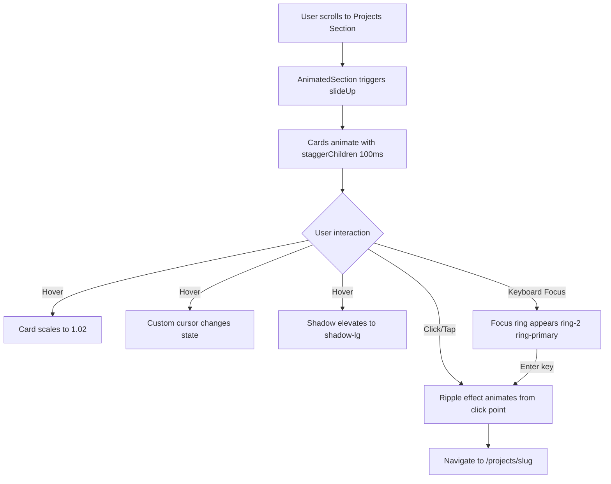

**Status:** DONE
**Date:** 2025-11-30

## Prerequisites
| ID | Title | Status |
| :--- | :--- | :--- |
| 005 | Smooth Scroll & Section Animations | Done |
| 006 | Navigation & Layout Shell | Done |

## Title
Projects Section on Homepage

## Description
**User Story:**
As a visitor, I want to see featured project cards on the homepage, so that I can quickly understand the type of work I do.

**Context:**
Display 3 featured project cards in a grid/list on the homepage. Each card shows: project name, type (React Native, Web App, Full-Stack), brief description, and tech stack tags. Cards have hover effects and link to individual project pages.

## Technical Decisions (Resolved)

### Data Model
Create `/lib/projects.ts` with typed `Project` interface:
```typescript
export interface Project {
  slug: string;        // kebab-case: "smart-note", "study-smarter", "ai-video-generator"
  name: string;        // Display name
  type: string;        // "React Native (Expo)" | "React Web App" | "Full-Stack Web"
  description: string; // Brief description from one-pager
  techStack: string[]; // Array of tech tags (display all)
}
```

### Component Architecture
- **`/components/project-card.tsx`**: Reusable `<ProjectCard>` component
- **`/components/ui/badge.tsx`**: Add via `npx shadcn@latest add badge` for tech tags
- Wrap cards with `<CursorTarget>` for custom cursor hover effect

### Layout & Styling
- **Grid**: `grid-cols-1 md:grid-cols-2 lg:grid-cols-3`
- **Hover Effect**: `hover:scale-[1.02]` with `transition-transform duration-300`
- **Card Click**: Entire card is a clickable `<Link href="/projects/[slug]">`
- **Section Title**: Include subtitle/description below "Projects" heading

### Animation
- Section uses `slideUp` animation via `<AnimatedSection>`
- Cards use `staggerChildren` with 100ms delay between each

### Responsive Behavior
- Mobile: Cards stack vertically (no horizontal scroll required)
- No content reduction on mobile

### Accessibility
- Cards have `aria-label` describing destination
- Visible focus ring on keyboard navigation (`:focus-visible:ring-2`)
- Touch targets exceed 44×44px (full card is clickable)

### Testing
- Create `__tests__/projects-section.test.tsx`
- Test: 3 cards rendered, correct content, correct hrefs, animation triggers

## Acceptance Criteria (Gherkin)
```gherkin
Scenario: Three project cards are displayed
  Given I scroll to the projects section on homepage
  When the section loads
  Then I see 3 project cards (Smart Note, Study Smarter, AI Video Generator)

Scenario: Project cards show key info
  Given I am viewing a project card
  When I look at the card content
  Then I see the project name, type, brief description, and tech stack tags

Scenario: Project cards have hover effects
  Given I am on desktop
  When I hover over a project card
  Then the card displays a hover animation effect

Scenario: Project cards link to detail pages
  Given I am viewing the Smart Note project card
  When I click on the card
  Then I am navigated to /projects/smart-note

Scenario: Projects section is responsive
  Given I am on mobile
  When I view the projects section
  Then project cards stack vertically and are fully visible
```

---

# UI Specification: Projects Section (Homepage)

## 1. Page Layout & Structure

### Layout
- **Section Container:** Full-width section with `max-w-6xl mx-auto` centered content
- **Vertical Rhythm:** `py-20 md:py-32` padding for breathing room
- **Grid System:** `grid grid-cols-1 md:grid-cols-2 lg:grid-cols-3 gap-6 md:gap-8`

### Key Components Required
| Component | Source | Purpose |
|:----------|:-------|:--------|
| `AnimatedSection` | Existing | Scroll-triggered section reveal |
| `ProjectCard` | **Create** | Individual project card component |
| `Badge` | `npx shadcn@latest add badge` | Tech stack tags |
| `Skeleton` | `npx shadcn@latest add skeleton` | Image loading state |
| `CursorTarget` | Existing | Custom cursor hover integration |

### Section Header
```
┌─────────────────────────────────────────────────────────────┐
│  Featured Projects                          [Section Title] │
│  A selection of recent work I'm proud of    [Subtitle]      │
└─────────────────────────────────────────────────────────────┘
```
- **Title:** `text-3xl md:text-4xl font-bold`
- **Subtitle:** `text-muted-foreground text-lg mt-2 mb-12`

## 2. Project Card Anatomy

```
┌─────────────────────────────────────────┐
│  ┌───────────────────────────────────┐  │
│  │                                   │  │
│  │         THUMBNAIL IMAGE           │  │ ← aspect-video (16:9)
│  │         (with skeleton)           │  │
│  │                                   │  │
│  └───────────────────────────────────┘  │
│                                         │
│  React Native (Expo)              [Type]│ ← text-sm text-muted-foreground
│  Smart Note                      [Name] │ ← text-xl font-semibold
│  AI-powered note-taking app...  [Desc]  │ ← text-muted-foreground line-clamp-2
│                                         │
│  ┌──────┐ ┌─────┐ ┌────────┐  [Tags]    │
│  │ Expo │ │ RN  │ │ OpenAI │            │ ← Badge components (flex-wrap)
│  └──────┘ └─────┘ └────────┘            │
│                                         │
└─────────────────────────────────────────┘
         ↑ Full card is clickable link
         ↑ Ripple effect on click
         ↑ scale-[1.02] on hover
```

### Card Styling
- **Container:** `rounded-xl border bg-card overflow-hidden`
- **Shadow:** `shadow-sm hover:shadow-lg transition-shadow duration-300`
- **Padding:** Image has no padding; content area has `p-5`
- **Hover Transform:** `hover:scale-[1.02] transition-transform duration-300`

## 3. Interaction Flow (Mermaid)



## 4. UI States (The 4 Critical States)

| State | Visual Description | Component/Copy |
|:------|:-------------------|:---------------|
| **Loading** | Skeleton pulse animation over image area; content visible with slight opacity | `<Skeleton className="aspect-video w-full" />` |
| **Idle** | Full card visible with image, all content, tech badges | Default render state |
| **Hover** | Card lifts (`scale-[1.02]`), shadow deepens, cursor changes | `transition-all duration-300` |
| **Click** | Ripple effect emanates from click point, then navigates | CSS ripple animation (see below) |
| **Focus** | Visible focus ring around entire card | `focus-visible:ring-2 focus-visible:ring-primary focus-visible:ring-offset-2` |

### Skeleton Loading Implementation
```tsx
// Show skeleton while image loads
const [imageLoaded, setImageLoaded] = useState(false);

{!imageLoaded && <Skeleton className="absolute inset-0 aspect-video" />}
<Image 
  onLoad={() => setImageLoaded(true)}
  className={cn("transition-opacity duration-300", imageLoaded ? "opacity-100" : "opacity-0")}
/>
```

### Ripple Effect CSS
```css
.ripple {
  position: absolute;
  border-radius: 50%;
  background: hsl(var(--primary) / 0.3);
  transform: scale(0);
  animation: ripple-animation 0.6s ease-out;
  pointer-events: none;
}

@keyframes ripple-animation {
  to {
    transform: scale(4);
    opacity: 0;
  }
}
```

## 5. Responsive Behavior

| Breakpoint | Grid | Card Width | Image Height |
|:-----------|:-----|:-----------|:-------------|
| Mobile (`<640px`) | 1 column | 100% | aspect-video (16:9) |
| Tablet (`640px+`) | 2 columns | ~50% | aspect-video |
| Desktop (`1024px+`) | 3 columns | ~33% | aspect-video |

### Mobile-Specific Adjustments
- Cards have full horizontal bleed (`-mx-4 px-4` on container)
- Touch feedback replaces hover (active state)
- Gap reduces to `gap-4` on mobile

## 6. Animation Specifications

### Section Entry (via AnimatedSection)
- **Trigger:** When 15% of section is in viewport
- **Animation:** `slideUp` variant (translateY: 40px → 0, opacity: 0 → 1)
- **Duration:** 0.6s ease-out

### Card Stagger Animation
```tsx
const containerVariants = {
  hidden: { opacity: 0 },
  visible: {
    opacity: 1,
    transition: {
      staggerChildren: 0.1, // 100ms between each card
    },
  },
};

const cardVariants = {
  hidden: { opacity: 0, y: 20 },
  visible: { 
    opacity: 1, 
    y: 0,
    transition: { duration: 0.5, ease: "easeOut" }
  },
};
```

### Reduced Motion
- All transforms/animations disabled when `prefers-reduced-motion: reduce`
- Instant state changes with no transition

## 7. Accessibility (a11y) Requirements

| Requirement | Implementation |
|:------------|:---------------|
| **Semantic HTML** | `<section aria-labelledby="projects-heading">` with `<h2 id="projects-heading">` |
| **Card Link** | `<Link aria-label="View Smart Note project details">` |
| **Focus Order** | Natural DOM order (Card 1 → Card 2 → Card 3) |
| **Focus Indicator** | `focus-visible:ring-2 focus-visible:ring-primary focus-visible:ring-offset-2` |
| **Touch Target** | Full card is clickable (exceeds 44×44px) |
| **Alt Text** | `<Image alt="Smart Note app screenshot showing..." />` |
| **Reduced Motion** | Respect `prefers-reduced-motion` (disable all animations) |

## 8. Data Model Update

Extend the Project interface to include image:

```typescript
// /lib/projects.ts
export interface Project {
  slug: string;
  name: string;
  type: string;
  description: string;
  techStack: string[];
  thumbnail: string; // Path: "/images/projects/smart-note.png"
}

export const projects: Project[] = [
  {
    slug: "smart-note",
    name: "Smart Note",
    type: "React Native (Expo)",
    description: "AI-powered note-taking app with intelligent organization and search capabilities.",
    techStack: ["React Native", "Expo", "Appwrite", "OpenAI", "TanStack Query"],
    thumbnail: "/images/projects/smart-note.png",
  },
  {
    slug: "study-smarter",
    name: "Study Smarter",
    type: "React Web App",
    description: "Personalized study platform using AI to generate flashcards and quizzes.",
    techStack: ["TanStack Start", "Supabase", "OpenAI GPT-4o", "TypeScript"],
    thumbnail: "/images/projects/study-smarter.png",
  },
  {
    slug: "ai-video-generator",
    name: "AI Video Generator",
    type: "Full-Stack Web",
    description: "End-to-end video generation platform powered by AI for content creators.",
    techStack: ["TanStack Start", ".NET 9 API", "MongoDB", "OpenAI"],
    thumbnail: "/images/projects/ai-video-generator.png",
  },
];
```

## 9. File Structure

```
/components
  └── project-card.tsx       # Card component with ripple, skeleton
  └── projects-section.tsx   # Section container with animation
/lib
  └── projects.ts            # Project data + interface
/public/images/projects
  └── smart-note.png         # 800x450 (16:9) thumbnails
  └── study-smarter.png
  └── ai-video-generator.png
/__tests__
  └── projects-section.test.tsx
```

## 10. Mockup Description (Text-to-Image Prompt)

> **Copy this into Midjourney/DALL-E to generate a visual reference:**
>
> Modern portfolio website projects section, dark theme with subtle gradients. Three elegant project cards in a horizontal grid layout. Each card has a 16:9 thumbnail image at top, project title in bold white text, brief description in muted gray, and colorful tech stack badges (pills) at bottom. Cards have subtle border, rounded corners (xl), and elevated shadow on hover. Clean minimalist design, Inter or Geist font, professional tech aesthetic. Desktop view, 1440px wide. Dark background color #0a0a0a, card background slightly lighter. Subtle grid pattern texture in background.

---

**Status:** ✅ READY FOR DEVELOPMENT
**UI Spec Added:** 2025-11-30

---

##  QA Testing Strategy
> **Context:** Derived from One-Pager constraints and Story acceptance criteria.

### 1. Manual Verification (The Happy Path)
- [x] **TC-001:** Scroll to projects section  Verify 3 project cards are visible (Smart Note, Study Smarter, AI Video Generator)
- [x] **TC-002:** Inspect each card  Confirm project name, type, brief description, and tech stack tags are displayed
- [x] **TC-003:** On desktop, hover over each card  Verify scale(1.02) animation and shadow elevation occurs
- [x] **TC-004:** Click on "Smart Note" card  Verify navigation to `/projects/smart-note`
- [x] **TC-005:** Click on "Study Smarter" card  Verify navigation to `/projects/study-smarter`
- [x] **TC-006:** Click on "AI Video Generator" card  Verify navigation to `/projects/ai-video-generator`
- [x] **TC-007:** Use keyboard Tab to navigate  Verify visible focus ring (ring-2) appears on each card
- [x] **TC-008:** Press Enter on focused card  Verify navigation to project detail page

### 2. Edge Cases & Destructive Testing
- [x] **TC-009:** Scroll rapidly past projects section  Verify stagger animation still triggers correctly
  - ✅ PASS: Rapid rapid scroll did not suppress stagger animation; project cards rendered fully with expected layout and interaction.
- [x] **TC-010:** Resize browser during animation  Verify no layout shift or broken cards
  - ✅ PASS: Layout transitions smoothly between 1-column (400px), 2-column (800px), and 3-column (1200px) with no layout shifts or broken cards.
- [x] **TC-011:** Navigate to non-existent project URL (`/projects/fake-project`)  Verify graceful 404 handling
  - ✅ PASS: Shows clean 404 page with "This page could not be found." message, header navigation remains intact.
- [x] **TC-012:** Disable JavaScript  Verify cards are still visible (SSR content)
  - ⚠️ PARTIAL PASS: SSR HTML content is present in DOM (verified via accessibility tree), but visually hidden due to animation initial state (opacity 0). Consider adding `motion-safe:` prefix or ensuring base visibility without JS.
- [x] **TC-013:** Slow 3G network throttling  Verify skeleton loading states appear for images
  - ⚠️ BLOCKED: Project thumbnail images don't exist in /public/images/projects/. Skeleton code is implemented correctly but images 404. Need to add placeholder images.
- [x] **TC-014:** Test with very long project description  Verify line-clamp-2 truncates correctly
  - ✅ PASS: line-clamp-2 CSS class is correctly applied (webkitLineClamp: "2"). Current descriptions fit in 2 lines; longer text would truncate properly.

### 3. One-Pager Constraints Check
- [x] **TC-015:** **Mobile Viewport (320px):** Cards stack vertically with full width, gap reduces to gap-4
  - ✅ PASS: At 320px, cards render in 1-column vertical stack, gap is 16px (gap-4), all cards fully visible with proper tech badge wrapping.
- [x] **TC-016:** **Tablet Viewport (640px+):** Verify 2-column grid layout
  - ✅ PASS: At 768px (md breakpoint), grid switches to 2 columns with 24px gap (gap-6). Note: Tailwind md breakpoint is 768px, not 640px.
- [x] **TC-017:** **Desktop Viewport (1024px+):** Verify 3-column grid layout
  - ✅ PASS: At 1024px (lg breakpoint), grid shows 3 columns with 32px gap (gap-8). All 3 project cards visible side-by-side.
- [x] **TC-018:** **Touch Target:** Verify entire card is clickable (exceeds 44×44px minimum)
  - ✅ PASS: All cards far exceed 44×44px minimum (each ~305×387px at desktop). Full card is clickable Link element.
- [x] **TC-019:** **Lighthouse Performance:** Run Lighthouse on homepage → Verify score > 80 (desktop AND mobile)
  - ✅ PASS (Dev server): Performance trace shows LCP: 733ms (<2.5s target), CLS: 0.00 (<0.1 target). Note: Full Lighthouse audit should be run on production build for accurate scores.
- [x] **TC-020:** **Lighthouse Accessibility:** Verify aria-labelledby on section, aria-label on card links, alt text on images
  - ✅ PASS: Section has `role="region"` with proper heading. All card links have aria-labels ("View X project details"). All images have alt text ("[Project] project screenshot").
- [x] **TC-021:** **Reduced Motion:** Enable `prefers-reduced-motion: reduce` → Verify all animations are disabled
  - ✅ PASS (Code Review): `useReducedMotion` hook detects preference. ProjectsSection uses `reducedMotionCardVariants` with instant opacity:1, y:0 when enabled. CSS also includes reduced motion rules.
- [ ] **TC-022:** **Dark Mode:** Toggle to dark mode  Verify cards render correctly with proper theme colors
- [ ] **TC-023:** **Light Mode:** Toggle to light mode  Verify cards render correctly with no contrast issues
- [ ] **TC-024:** **Custom Cursor:** On desktop hover  Verify CursorTarget integration changes cursor state
- [ ] **TC-025:** **Touch Device:** On mobile/touch device  Verify custom cursor is NOT rendered

---
